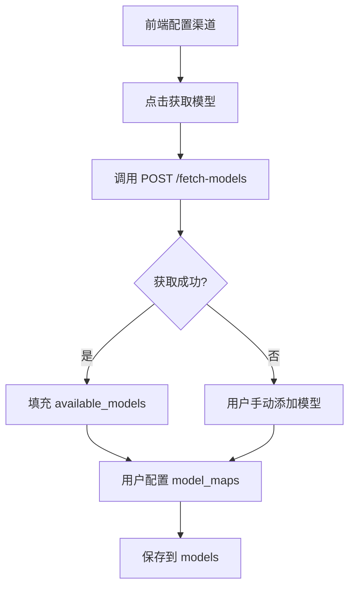
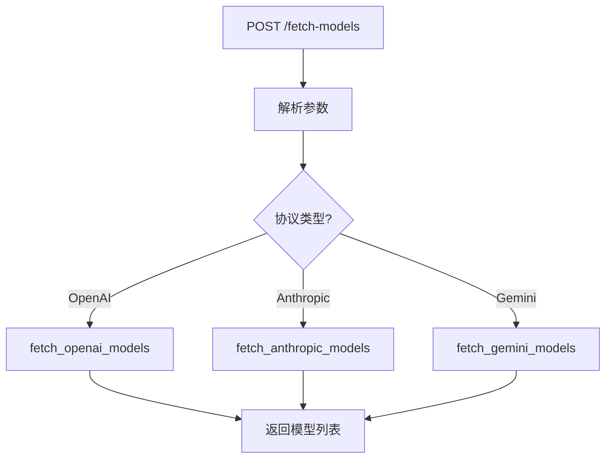

# 渠道模型获取与配置

## 0. 术语

| 术语 | 定义 |
|------|------|
| 渠道 (Channel) | 上游 AI 服务提供商配置，含 API Key 和端点 |
| 分组 (Group) | 路由策略单元，对外暴露为"模型名" |
| 分组项 (GroupItem) | 分组内的具体配置，关联渠道+实际模型名 |
| 模型获取 | 调用上游 `/v1/models` 获取支持的模型列表（实时） |
| 模型映射 | 代理转发时将请求模型名转换为实际上游模型名 |

## 1. 决策与约束

### 背景

当前创建分组项时，`model_name` 字段需要手动填写。用户不知道上游支持哪些模型，容易填错。

**参考 Octopus 设计**（`/Users/gclm/workspace/product/octopus/`）：

```go
// internal/model/channel.go
Model         string  // 从上游获取的模型列表
CustomModel   string  // 用户自定义模型列表

// 使用时合并
channelModelNames := xstrings.SplitTrimCompact(",", channel.Model, channel.CustomModel)
```

### 目标

1. **模型获取**：新增 `POST /api/v1/admin/fetch-models` 端点（不依赖渠道 ID）
2. **模型配置**：渠道新增 `models` JSON 字段，整合：
   - `available_models` - 可用模型列表（上游获取 + 用户自定义）
   - `model_maps` - 模型映射（代理转发时用，从原 `model_maps` 字段迁移）
3. **前端流程**：获取模型 → 选择/手动添加 → 配置映射 → 保存

### 不做什么

- 不单独存储上游模型（整合到 `models_config.available_models`）
- 不自动同步上游模型变更
- 不在创建渠道时自动获取（用户主动触发）

### 复杂度档位

走默认档位（单机、低并发、SQLite）。

## 2. 方案

### 2.1 名词层

**现状**：

```rust
// channels.rs - 渠道结构
pub struct Channel {
    pub id: String,
    pub name: String,
    pub api_keys: Vec<String>,
    pub endpoints: Vec<EndpointConfig>,
    pub model_maps: serde_json::Value,  // 模型映射 {"gpt-4": "gpt-4-turbo"}
    // ...
}
```

**变化**：

```rust
// 新增请求结构（不依赖渠道 ID）
pub struct FetchModelsRequest {
    pub endpoint_type: EndpointType,  // 协议类型
    pub base_url: String,             // 上游地址
    pub api_key: String,              // API Key
}

// 渠道字段变更
pub struct Channel {
    // ... 现有字段
    // pub model_maps: serde_json::Value,  // 删除此字段
    pub models: serde_json::Value,  // 新增：整合模型配置
}

// models 结构
{
    "available_models": ["gpt-4", "gpt-4-turbo", "claude-sonnet-4-20250514"],
    "model_maps": {
        "gpt-4": "gpt-4-turbo"
    }
}
```

### 2.2 编排层

**整体流程**：



**模型获取流程**：



**关键函数**：

1. `fetch_models(req: FetchModelsRequest) -> Vec<String>` - 主入口
2. `fetch_openai_models(base_url, api_key) -> Vec<String>` - OpenAI 协议
3. `fetch_anthropic_models(base_url, api_key) -> Vec<String>` - Anthropic 协议（含分页）
4. `fetch_gemini_models(base_url, api_key) -> Vec<String>` - Gemini 协议（含分页）

### 2.3 挂载点

- 新增 `POST /api/v1/admin/fetch-models` - 获取上游模型列表
- 修改 `channels` 表 - `model_maps` 重命名为 `models`，结构变更
- 修改 `channels::create/update` - 支持 `models` 字段
- 修改 `proxy/mod.rs` - `apply_model_mapping` 从 `models.model_maps` 读取

### 2.4 推进策略

1. **数据库迁移** - `model_maps` 重命名为 `models`，迁移旧数据
2. **模型获取服务** - 实现 `fetch_models` 及三种协议的获取逻辑
3. **API 端点** - 新增 `/fetch-models` 路由和处理器
4. **渠道 CRUD 更新** - 支持 `models` 字段的读写
5. **代理层适配** - `apply_model_mapping` 从新字段读取
6. **测试** - 单元测试（mock 上游响应）

### 2.5 结构健康度

**文件级**：`channels.rs` 约 350 行，职责单一（渠道 CRUD），新增端点可接受。

**目录级**：`api/handlers/admin/` 下已有 6 个文件，再加 1 个可接受。

**结论**：不做微重构。

## 3. 验收契约

### 模型获取

| 场景 | 输入 | 期望结果 |
|------|------|----------|
| 获取 OpenAI 模型 | POST /fetch-models {endpoint_type: "openai_chat", base_url: "...", api_key: "sk-xxx"} | 返回 ["gpt-4", "gpt-4-turbo", ...] |
| 获取 Anthropic 模型 | POST /fetch-models {endpoint_type: "anthropic", base_url: "...", api_key: "sk-ant-xxx"} | 返回 ["claude-sonnet-4-20250514", ...] |
| 获取 Gemini 模型 | POST /fetch-models {endpoint_type: "gemini", base_url: "...", api_key: "AIza..."} | 返回 ["gemini-pro", ...] |
| 无效 API Key | POST /fetch-models {api_key: "invalid"} | 返回 400 错误 |
| 上游不可达 | POST /fetch-models {base_url: "http://invalid"} | 返回 502 错误 |

### 模型配置

| 场景 | 输入 | 期望结果 |
|------|------|----------|
| 创建渠道 | POST /channels {models: {available_models: [...], model_maps: {...}}} | 返回渠道 + models 字段 |
| 更新渠道 | PUT /channels {models: {...}} | 返回更新后的渠道 |
| 查询渠道 | GET /channels/{id} | 返回渠道 + models 字段 |
| 模型映射 | 代理请求 model=gpt-4，model_maps: {"gpt-4": "gpt-4-turbo"} | 实际请求 gpt-4-turbo |

**反向核对**：

- 手动填写 model_name 仍可用（不破坏现有流程）
- 此端点仅用于前端展示，不影响代理转发
- 旧 `model_maps` 数据迁移到 `models.model_maps` 后仍可用

## 4. 开放问题

1. **超时设置**：上游请求超时时间？（建议 10 秒）
2. **分页支持**：Gemini/Anthropic 分页是否需要全部获取？（建议全部获取）
3. **模型名格式**：上游返回的 model_id 是否需要规范化？（建议去前缀，如 `models/gemini-pro` → `gemini-pro`）
