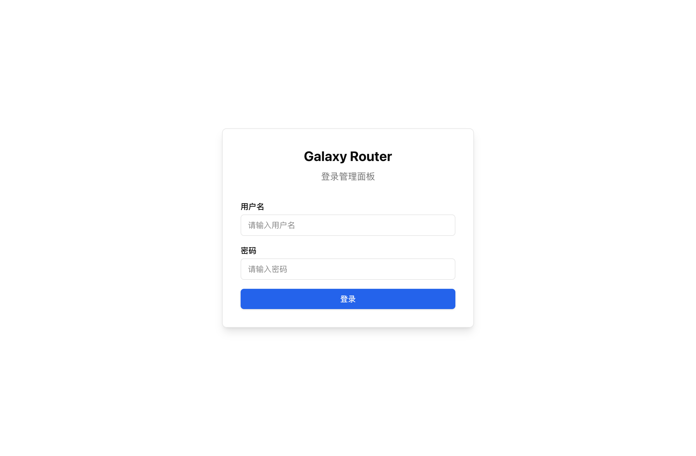
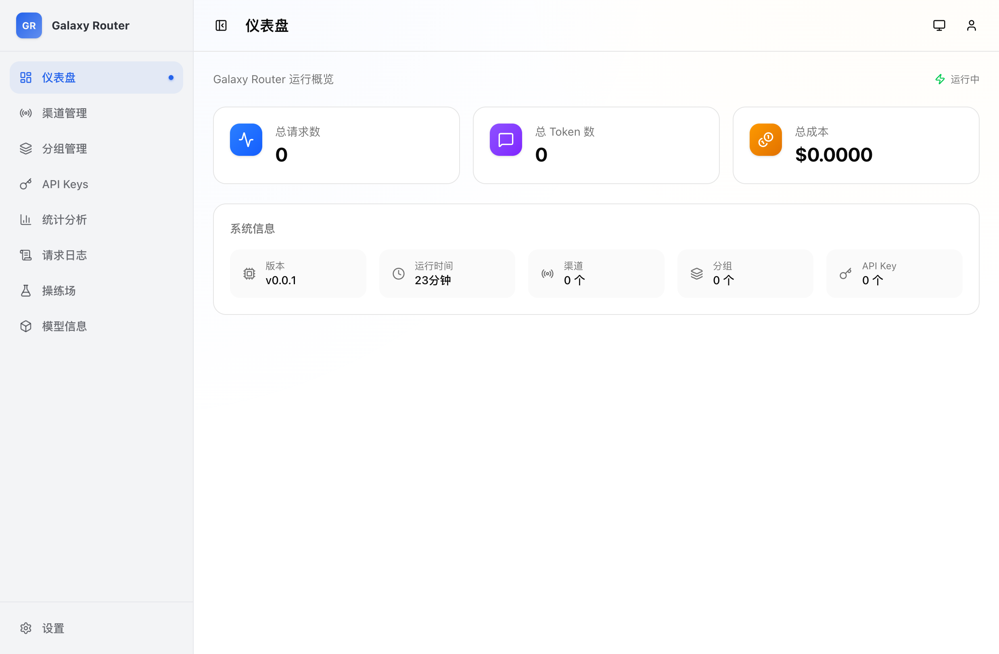
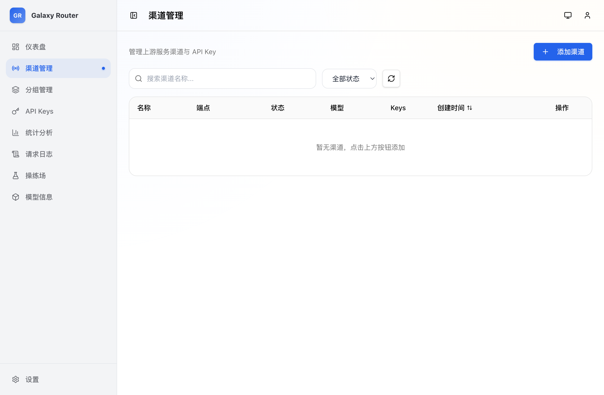
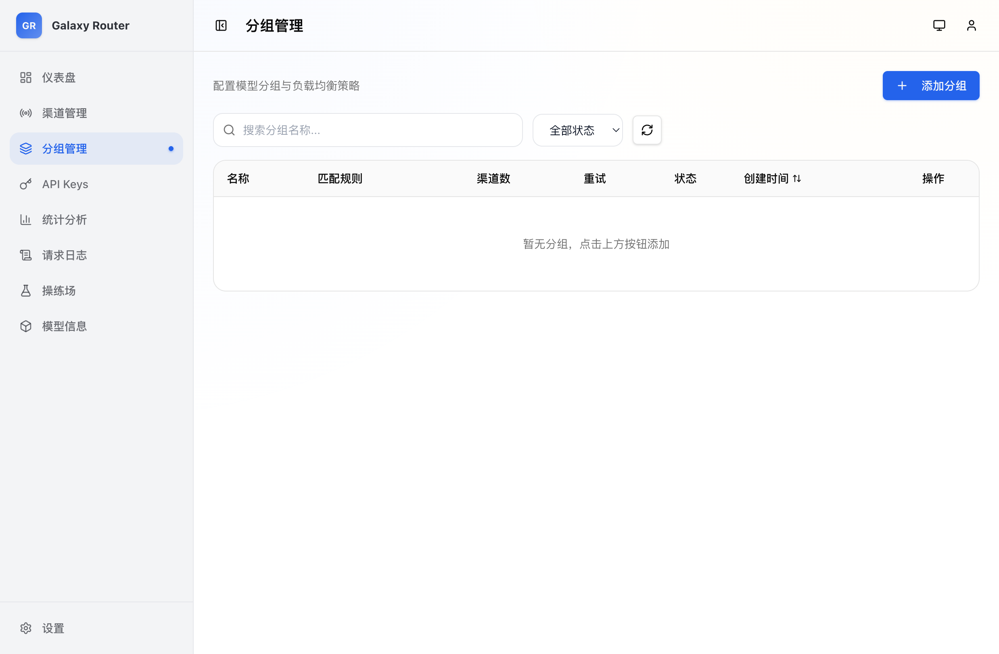
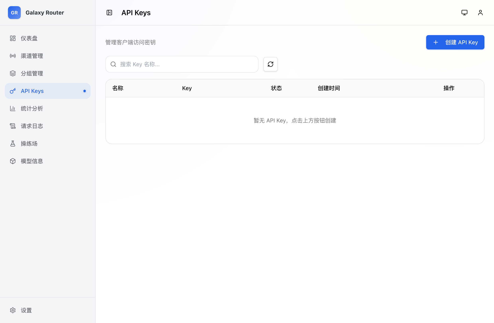
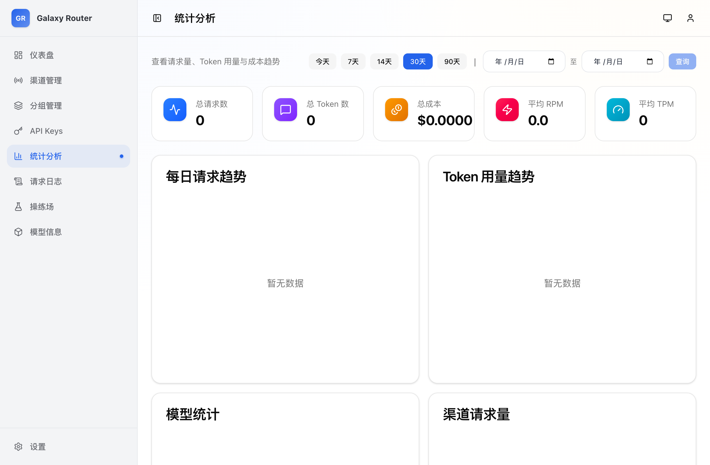
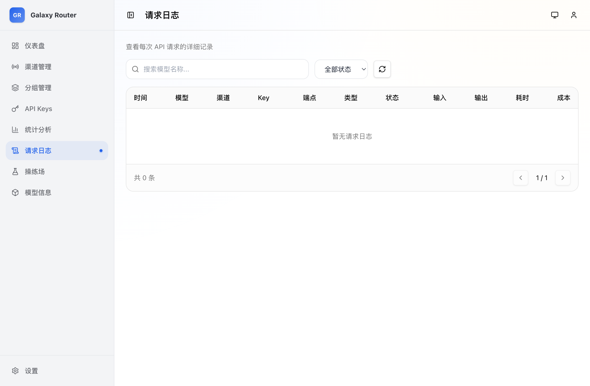
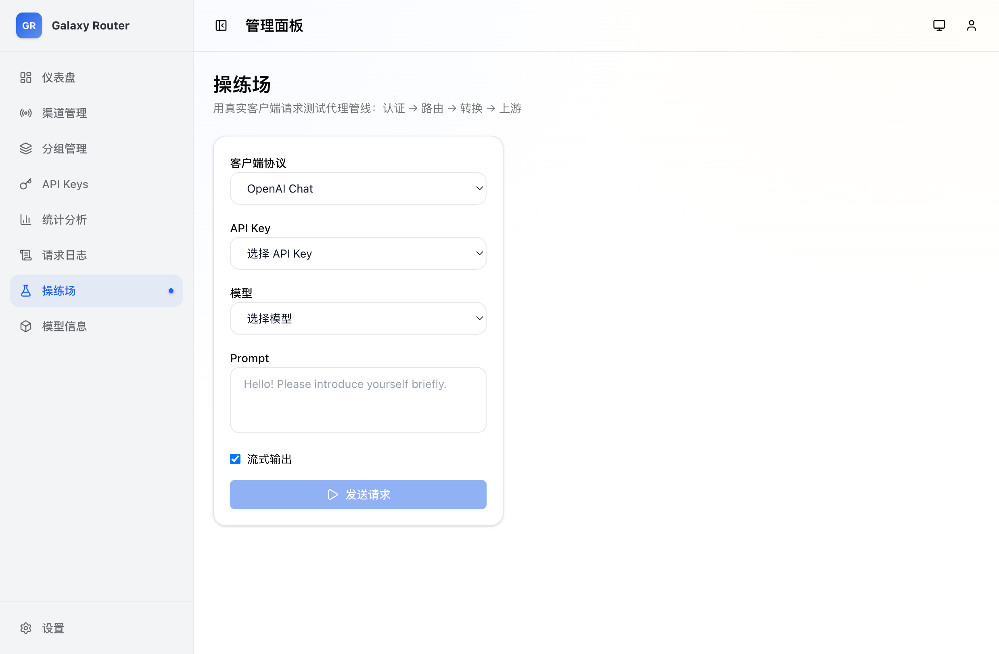
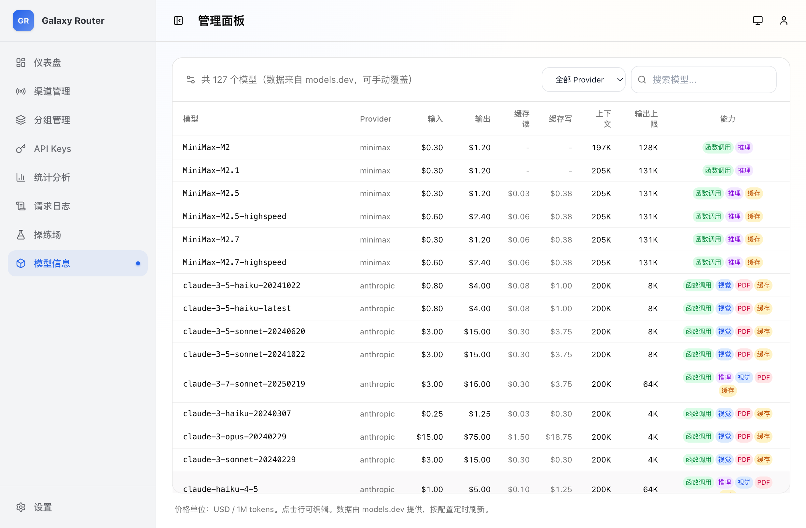
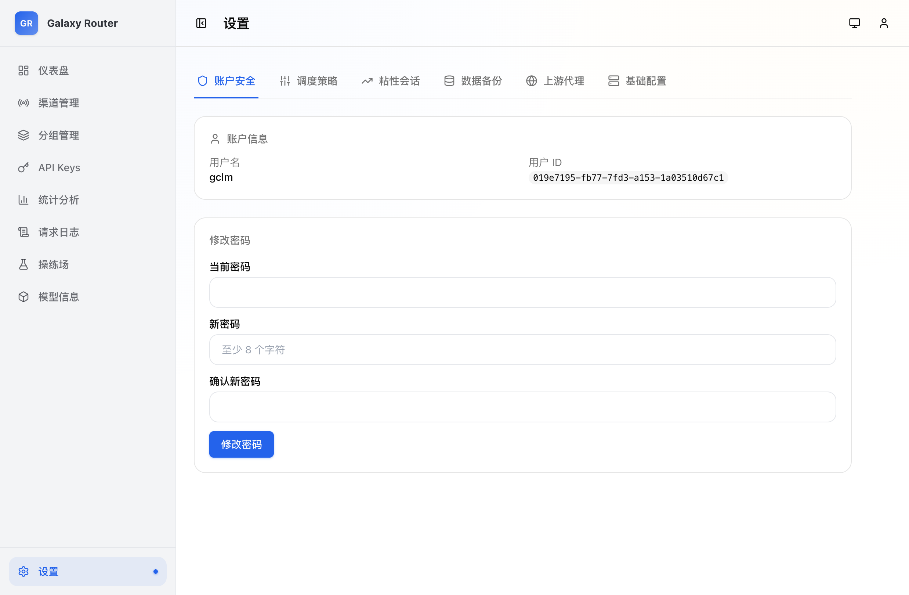

# 使用手册

Galaxy Router 是一个 AI 协议互转代理网关，让不同协议的 AI 客户端能够透明访问不同协议的上游服务。

## 核心概念

| 概念 | 说明 |
|---|---|
| **渠道（Channel）** | 上游 AI 服务提供商的接入配置，包含 API Key、端点地址和协议类型 |
| **分组（Group）** | 将多个渠道的同一模型聚合为虚拟模型，支持负载均衡和故障转移 |
| **API Key** | 分发给客户端使用的密钥，客户端通过此密钥访问代理 |
| **模型信息** | 各模型的能力描述和定价数据，用于统计成本 |

**请求流程：**

```
客户端 → API Key 鉴权 → 分组匹配 → 渠道选择 → 协议转换 → 上游服务
```

## 登录

首次访问会进入初始化页面，设置管理员账号后跳转到登录页。



## 仪表盘

登录后进入仪表盘，展示系统运行概览：运行状态、总请求数、总 Token 数、总成本，以及系统信息（版本、运行时间、渠道/分组/Key 数量）。



## 渠道管理

渠道是上游 AI 服务的接入配置。每个渠道可以配置多个端点（endpoint），支持不同的协议类型。



### 创建渠道

点击「添加渠道」，填写以下信息：

| 字段 | 说明 |
|---|---|
| 名称 | 渠道标识，如 "OpenAI Official" |
| 端点 | 协议类型 + Base URL 的组合，每个端点可单独启用/禁用 |
| API Keys | 上游服务的密钥列表，每个 Key 可设置备注和启用/禁用状态 |
| 并发数 | 该渠道的最大并发请求数 |
| 自定义请求头 | 需要注入到上游请求的额外 Header |
| 速率限制 | RPM（每分钟请求数）/ TPM（每分钟 Token 数） |
| 故障阈值 | 连续失败次数达到后自动熔断 |
| 熔断时间 | 熔断后等待恢复的分钟数 |

### 支持的协议类型

| 协议 | 端点路径 | 说明 |
|---|---|---|
| `openai_chat` | `/chat/completions` | OpenAI Chat Completions API |
| `openai_response` | `/responses` | OpenAI Responses API |
| `anthropic` | `/messages` | Anthropic Messages API |
| `openai_embedding` | `/embeddings` | OpenAI Embeddings API |
| `openai_images` | `/images/generations` | OpenAI Images API |

### 模型测试

创建渠道后可以测试连通性。点击「测试」按钮，选择模型名称，系统会直连上游发送测试请求。

## 分组管理

分组是 Galaxy Router 实现负载均衡和故障转移的核心机制。将多个渠道中相同的模型加入同一分组，系统会根据优先级、权重和实时负载自动选择最优渠道。



### 创建分组

1. 点击「添加分组」，填写名称（通常用模型名，如 `gpt-4o`）
2. 可选配置正则匹配（如 `gpt-4o.*`，客户端请求匹配的模型时自动路由到此分组）
3. 添加分组项（Group Item）：
   - 选择渠道
   - 填写实际模型名（如 `gpt-4o-2024-08-06`）
   - 设置优先级（数字越大优先级越高）
   - 设置权重（同优先级下按权重随机分配）

### 分组配置

| 字段 | 说明 |
|---|---|
| 正则匹配 | 客户端请求的模型名匹配此正则时路由到此分组 |
| 启用重试 | 请求失败后是否自动重试其他渠道 |
| 最大重试次数 | 最多重试几次 |
| 首 Token 超时 | 等待首个响应 Token 的超时时间（秒） |

## API Keys

API Key 是分发给客户端使用的密钥。客户端在请求时通过 `Authorization: Bearer <api_key>` 头传递。



### 客户端使用

创建 API Key 后，客户端可以像使用 OpenAI API 一样调用 Galaxy Router：

```bash
# OpenAI 兼容接口
curl http://127.0.0.1:8080/v1/chat/completions \
  -H "Authorization: Bearer gp-xxxx" \
  -H "Content-Type: application/json" \
  -d '{
    "model": "gpt-4o",
    "messages": [{"role": "user", "content": "Hello"}]
  }'

# Anthropic 兼容接口
curl http://127.0.0.1:8080/v1/messages \
  -H "x-api-key: gp-xxxx" \
  -H "anthropic-version: 2023-06-01" \
  -H "Content-Type: application/json" \
  -d '{
    "model": "claude-sonnet-4-20250514",
    "max_tokens": 1024,
    "messages": [{"role": "user", "content": "Hello"}]
  }'
```

**兼容的 SDK：** 任何 OpenAI SDK 或 Anthropic SDK，只需将 `base_url` 指向 `http://127.0.0.1:8080/v1`。

```python
# Python OpenAI SDK 示例
from openai import OpenAI

client = OpenAI(
    api_key="gp-xxxx",
    base_url="http://127.0.0.1:8080/v1"
)

response = client.chat.completions.create(
    model="gpt-4o",
    messages=[{"role": "user", "content": "Hello"}]
)
```

### 支持的代理端点

| 端点 | 方法 | 说明 |
|---|---|---|
| `/v1/chat/completions` | POST | OpenAI Chat Completions |
| `/v1/responses` | POST | OpenAI Responses |
| `/v1/messages` | POST | Anthropic Messages |
| `/v1/embeddings` | POST | OpenAI Embeddings |
| `/v1/images/generations` | POST | OpenAI Images |
| `/v1/models` | GET | 模型列表 |

## 统计分析

统计分析页面展示 Token 使用量、请求次数、成本等数据，支持按模型、渠道、日期维度查看。



## 请求日志

请求日志记录每一次代理请求的详细信息，包括请求模型、实际路由的渠道、Token 用量、延迟、状态码和错误信息。



## 操练场

操练场（Playground）是一个内置的聊天测试界面，可以直接在管理面板中测试模型调用，无需外部工具。



选择模型后直接发送消息，系统会使用已配置的渠道和分组进行路由，方便验证配置是否正确。

## 模型信息

模型信息页面展示系统已知的所有模型的能力和定价数据，包括输入/输出价格、最大 Token 数、是否支持视觉、函数调用等。



模型数据支持两个来源：
- **远程同步**：定期从上游 Provider 抓取最新定价数据
- **手动配置**：通过管理界面手动添加或修改模型信息

## 设置

系统设置页面用于调整运行时参数。



| 设置项 | 说明 |
|---|---|
| 调度器 Top-K | 候选渠道数量，影响负载均衡精度 |
| 评分权重 | 优先级、负载、队列、错误率、首 Token 延迟的权重配比 |
| 粘性会话 | 同一 API Key 的连续请求是否路由到同一渠道 |
| 上游代理 | 所有出站请求是否通过 HTTP 代理 |

## 数据备份

系统支持配置数据的导入和导出（不包含用户账户、使用日志和统计数据）。

- **导出**：下载所有渠道、分组、API Key 和系统设置的 JSON 文件
- **导入**：上传 JSON 文件恢复配置（会覆盖现有数据）
- **重置**：清空所有配置数据（危险操作）

## 健康检查

系统提供健康检查端点，方便监控系统或负载均衡器检测服务状态：

```bash
curl http://127.0.0.1:8080/api/v1/health
```

返回示例：

```json
{
  "status": "ok",
  "version": "0.0.1",
  "needs_setup": false
}
```
